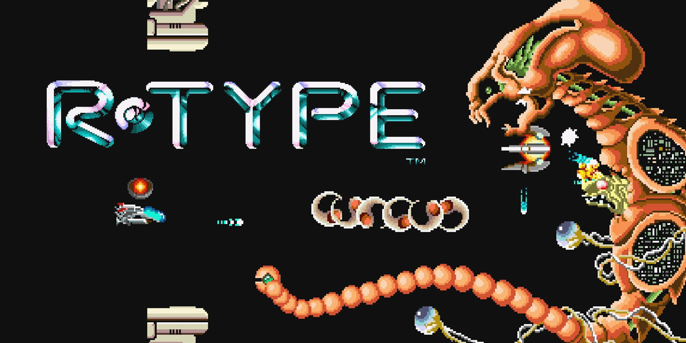

<a id="readme-top"></a>

<div align="center">
    
    <h1>R-Type Project</h1>
    <br />
</div>

<details>
  <summary>Table of Contents</summary>
  <ol>
    <li>
      <a href="#about-the-project">About The Project</a>
      <ul>
        <li><a href="#built-with">Built With</a></li>
      </ul>
    </li>
    <li>
      <a href="#getting-started">Getting Started</a>
      <ul>
        <li><a href="#prerequisites">Prerequisites</a></li>
        <li><a href="#installation">Installation</a></li>
      </ul>
    </li>
    <li><a href="#usage">Usage</a></li>
    <!-- <li><a href="#contributing">Contributing</a></li> Maybe later -->
    <!-- <li><a href="#license">License</a></li> Maybe later -->
    <li><a href="#contact">Contact</a></li>
    <!-- <li><a href="#acknowledgments">Acknowledgments</a></li> No need -->
  </ol>
</details>

## About The Project



The R-Type project is a project of the 5th semester of the Programme Grande Ecole in Epitech.

### Goal of the project

The goal of this project is to recreate the retro game of the same name, the [R-Type](https://www.youtube.com/watch?v=pVWtI0426mU).

The original part of the project is to create a cross-platform multiplayer game of the original R-Type game. It means that multiple players can connect and play together on the same level, regarding of their OS.

With this project, the goal is to make a real video game project : with an ECS structure, a professional organization...

<p align="right">(<a href="#readme-top">back to top</a>)</p>


### Built With

The project is built with the following libraries :

* [Boost Asio [1.83.0]][Asio-url]
* [SFML [2.6.1]][SFML-url]

<p align="right">(<a href="#readme-top">back to top</a>)</p>

## Getting Started

To start the project, you will need to install the project, build it and execute this. To do that, you will need to follow the below commands :

### Prerequisites

This is an example of how to list things you need to use the software and how to install them.
* Connan
  ```sh
  Command to install Connan
  ```

### Installation

To install the project, you need to execute the following commands.

1. Clone the repo
   ```sh
   git clone https://github.com/Corent1P/R-Type.git
   ```

2. If you are on windows, exec the install.exe file
   ```powershell
   .\install.exe
   ```

3. If you are on Linux, you need to exec the build.sh file
    ```sh
    ./build.sh
    ```

Once you've done all the previous steps, you should have if you are on windows a folder application where you will find two binaries (one for the server and one for the client). And if you are on Linux, you should have two executables files at the root of the project: r-type_server and r-type_client

<p align="right">(<a href="#readme-top">back to top</a>)</p>

## Usage

To use our program, you will need to execute the binaries.

### r-type_server

To have help for the server, you can execute the following command:
```sh
./r-type_server -h
```
or
```sh
./r-type_server --help
```

To start the server, you only have to execute the following command:
```sh
./r-type_server <portNumber>
```
**portNumber** is the port of your machine where the server will listen for client connections.

### r-type_client

To have help for the client, you can execute the following command:
```sh
./r-type_client -h
```
or
```sh
./r-type_client --help
```
To start the client, you only have to execute the following command:
```sh
./r-type_client <serverAdress> <serverPort>
```
**serverAdress** and **serverPort** are respectively the adress and the port of the server where your client will connect.

<p align="right">(<a href="#readme-top">back to top</a>)</p>


## Versions

- 1.0: Position and movement handling in server side
- 2.0: Shoot and ennemy spawn handling in server side

## Contact

Piqueto Corentin - corentin.piquet@epitech.eu

Rognon Xavier - xavier.rognon@epitech.eu

Ramstein Sacha - sacha.ramstein@epitech.eu

Grand Antoine - antoine.grand@epitech.eu

Jonathan Bantzhaffen - jonathan.bantzhaffen@epitech.eu

Project Link: [https://github.com/Corent1P/R-Type.git](https://github.com/Corent1P/R-Type.git)

<p align="right">(<a href="#readme-top">back to top</a>)</p>

[Asio-url]: https://www.boost.org/doc/libs/1_86_0/doc/html/boost_asio.html
[SFML-url]: https://www.sfml-dev.org/index-fr.php
